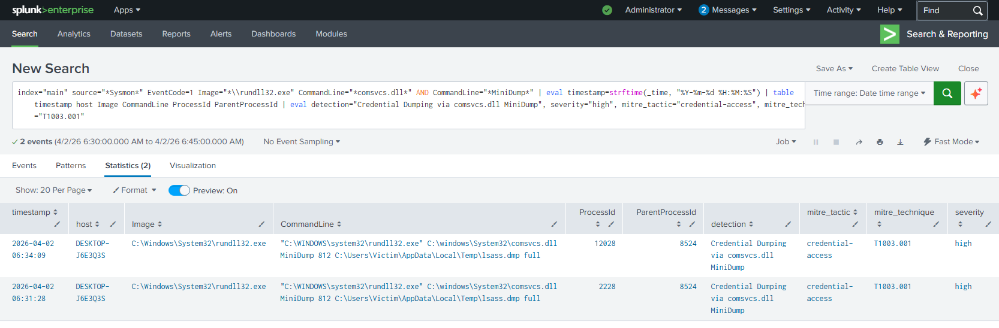

# Featured Detection: LSASS Credential Dumping (T1003.001)

### Objective
Detect adversaries attempting to dump the memory of the Local Security Authority Subsystem Service (LSASS) to steal credentials.

### Methodology
Initially, I attempted to detect this via **Sysmon Event ID 10 (Process Access)**. However, during testing, I discovered that specific access flags (e.g., `0x1010`) were inconsistent in the lab environment, leading to false negatives. 

**The Pivot:** I shifted the detection strategy to **Sysmon Event ID 1 (Process Creation)**, focusing on the specific command-line arguments used by the `comsvcs.dll` Living-off-the-Land (LotL) technique.

**Lab Evolution:** This detection was originally built and validated in a Wazuh environment. I have since migrated my home lab to Splunk and upgraded the detection logic to a platform-agnostic **Sigma** rule, demonstrating how this detection scales across different SIEMs.

### Technical Stack
* **SIEM:** Splunk (Current) / Wazuh Manager v4.x (Legacy)
* **Endpoint:** Windows 11 Enterprise
* **Telemetry:** Sysmon (Configured for Event ID 1 & 10)
* **Rule Format:** Sigma (Translated from Wazuh XML)

---

### The Rule Logic

The core concept hinges on identifying the execution of `rundll32.exe` while passing the `MiniDump` function call to `comsvcs.dll` via the command line. 

Depending on the platform, the implementation of this logic varies to optimize performance:
* **Current (Sigma/Splunk):** Utilizes fast string containment (`|contains|all` in Sigma, translating to `*comsvcs.dll*` and `*MiniDump*` wildcards in SPL) because regex can be computationally expensive at scale.
* **Legacy (Wazuh):** Utilized a PCRE2 regular expression `(?i)comsvcs\.dll.*MiniDump` to achieve the same match.

#### Current Implementation: Sigma
By converting the rule to Sigma, this detection can now be compiled into Splunk SPL, Microsoft Sentinel KQL, or Elastic EQL.

```yaml
title: Credential Dumping via comsvcs.dll MiniDump
id: f7e0e548-f99a-48be-b8e6-67d32f0baf9f
status: experimental
description: |
  Detects the execution of `rundll32.exe` calling `comsvcs.dll` with the *MiniDump* argument,
  a technique used to dump LSASS credentials
  (MITRE ATT&CK T1003.001 – OS Credential Dumping: LSASS Memory).
author: joanfx
date: 2026-04-02
references:
  - https://attack.mitre.org/techniques/T1003/001/
logsource:
  product: windows
  service: sysmon
  category: process_creation
detection:
  selection:
    EventID: 1
    Image|endswith: '\rundll32.exe'
    CommandLine|contains|all:
      - 'comsvcs.dll'
      - 'MiniDump'
  condition: selection
level: high
tags:
  - attack.credential_access
  - attack.t1003.001
  - attack.t1003
  - exfiltration
  - persistence
falsepositives:
  - Legitimate debugging or troubleshooting tools that invoke
    `comsvcs.dll` with the `MiniDump` flag.
```

#### Legacy Implementation: Wazuh XML
<details>
<summary>Click to view original Wazuh XML Rule</summary>

```xml
<group name="windows,sysmon">
  <rule id="100001" level="12">
    <if_sid>61603</if_sid>
    <field name="win.eventdata.commandLine" type="pcre2">(?i)comsvcs\.dll.*MiniDump</field>
    <description>Credential Dumping detected via comsvcs.dll</description>
    <mitre>
      <id>T1003.001</id>
    </mitre>
  </rule>
</group>
```
</details>

---

### Proof of Detection

#### Splunk Validation (Current Lab)
*(Converted Sigma rule to SPL and triggered via Splunk)*


#### Wazuh Validation (Legacy Lab)
*(Original Level 12 Alert on the malicious command execution)*


<details>
<summary>Click to view full Wazuh Log Event (JSON)</summary>

```json
{
  "timestamp": "2026-02-10T13:53:59.343-0500",
  "rule": {
    "level": 12,
    "description": "Credential Dumping detected via comsvcs.dll",
    "id": "100001",
    "mitre": {
      "id": ["T1003.001"],
      "tactic": ["Credential Access"],
      "technique": ["LSASS Memory"]
    }
  },
  "agent": {
    "id": "001",
    "name": "Win11-Detection-Lab",
    "ip": "192.168.209.134"
  },
  "data": {
    "win": {
      "eventdata": {
        "image": "C:\\\\Windows\\\\System32\\\\rundll32.exe",
        "commandLine": "\"C:\\\\WINDOWS\\\\system32\\\\rundll32.exe\" C:\\\\windows\\\\System32\\\\comsvcs.dll MiniDump 792 C:\\\\Users\\\\labuser\\\\AppData\\\\Local\\\\Temp\\\\lsass.dmp full",
        "originalFileName": "RUNDLL32.EXE",
        "processId": "6904",
        "user": "DESKTOP-G08D067\\\\labuser"
      }
    }
  }
}
```
</details>