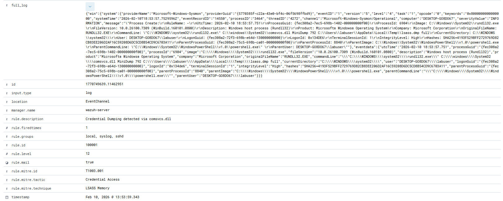

# Featured Detection: LSASS Credential Dumping (T1003.001)

### Objective
Detect adversaries attempting to dump the memory of the Local Security Authority Subsystem Service (LSASS) to steal credentials.

### Methodology
Initially attempted to detect via **Sysmon Event ID 10 (Process Access)**. However, during testing, I discovered that specific access flags (e.g., `0x1010`) were inconsistent in the lab environment, leading to false negatives. 

**The Pivot:** I shifted the detection strategy to **Sysmon Event ID 1 (Process Creation)**, focusing on the specific command-line arguments used by the `comsvcs.dll` Living-off-the-Land (LotL) technique.

### Technical Stack
* **SIEM:** Wazuh Manager (v4.x)
* **Endpoint:** Windows 11 Enterprise
* **Telemetry:** Sysmon (Configured for Event ID 1 & 10)

### The Rule Logic
The rule utilizes PCRE2 regex to identify the `MiniDump` function call within `comsvcs.dll` execution: `(?i)comsvcs\.dll.*MiniDump`

Wazuh Custom Rule (XML):
```xml
<group name="windows,sysmon">
  <rule id="100001" level="12">
    <if_sid>61603</if_sid>
    <field name="win.eventdata.commandLine" type="pcre2">(?i)comsvcs\.dll.*MiniDump</field>
    <description>Credential Dumping detected via comsvcs.dll</description>
    <mitre>
      <id>T1003.001</id>
    </mitre>
  </rule>
</group>
```

### Proof of Detection



Wazuh Manager successfully triggering a Level 12 Alert on the malicious command execution.

<details>
<summary>Click to view full Log Event (JSON)</summary>

```json
{
  "timestamp": "2026-02-10T13:53:59.343-0500",
  "rule": {
    "level": 12,
    "description": "Credential Dumping detected via comsvcs.dll",
    "id": "100001",
    "mitre": {
      "id": ["T1003.001"],
      "tactic": ["Credential Access"],
      "technique": ["LSASS Memory"]
    }
  },
  "agent": {
    "id": "001",
    "name": "Win11-Detection-Lab",
    "ip": "192.168.209.134"
  },
  "data": {
    "win": {
      "eventdata": {
        "image": "C:\\\\Windows\\\\System32\\\\rundll32.exe",
        "commandLine": "\"C:\\\\WINDOWS\\\\system32\\\\rundll32.exe\" C:\\\\windows\\\\System32\\\\comsvcs.dll MiniDump 792 C:\\\\Users\\\\labuser\\\\AppData\\\\Local\\\\Temp\\\\lsass.dmp full",
        "originalFileName": "RUNDLL32.EXE",
        "processId": "6904",
        "user": "DESKTOP-G08D067\\\\labuser"
      }
    }
  }
}
```
</details>