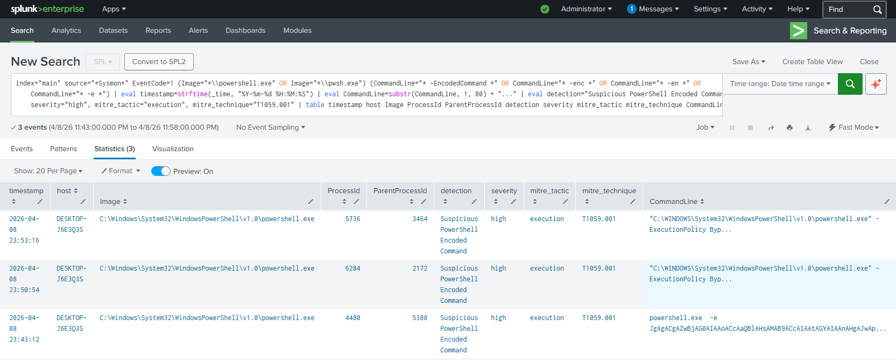

# Featured Detection: PowerShell Obfuscated Execution (T1059.001)

### Objective
Detect adversaries attempting to use base64 encoded PowerShell commands (`-EncodedCommand`) to obfuscate malicious activity and evade defensive mechanisms.

### Methodology
Initially, PowerShell execution can be noisy. I shifted the detection strategy to monitor **Sysmon Event ID 1 (Process Creation)** and **Security Event ID 4688**. Since raw Sysmon logs arrive as unparsed XML in this specific lab environment, I engineered the detection to bypass strict field extraction and perform a raw string search against the entire event payload. Attackers frequently use `-EncodedCommand` or its shortened variants (`-enc`, `-e`) to pass base64 payloads directly into memory without dropping scripts on disk.

### Technical Stack
* **SIEM:** Splunk Enterprise (v10.x)
* **Endpoint:** Windows 11 Enterprise
* **Telemetry:** Sysmon (Event ID 1) & Windows Security Auditing (Event ID 4688)

### The Rule Logic
The rule utilizes raw string matching to identify the specific flags associated with encoded execution, bypassing the need for pre-configured XML field extractions. The output is then parsed and formatted into a clean, analyst-ready table.

Splunk SPL Equivalent:
`index="main" source="*Sysmon*" EventCode=1 (Image="*\\powershell.exe" OR Image="*\\pwsh.exe") (CommandLine="* -EncodedCommand *" OR CommandLine="* -enc *" OR CommandLine="* -en *" OR CommandLine="* -e *")`

### Proof of Detection

Splunk successfully triggering on the malicious command execution.