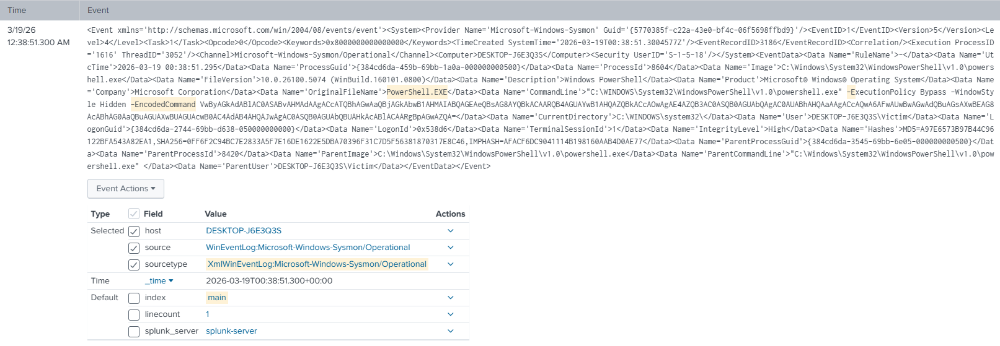

# Featured Detection: PowerShell Obfuscated Execution (T1059.001)

### Objective
Detect adversaries attempting to use base64 encoded PowerShell commands (`-EncodedCommand`) to obfuscate malicious activity and evade defensive mechanisms.

### Methodology
Initially, PowerShell execution can be noisy. I shifted the detection strategy to monitor **Sysmon Event ID 1 (Process Creation)** and **Security Event ID 4688**. Since raw Sysmon logs arrive as unparsed XML in this specific lab environment, I engineered the detection to bypass strict field extraction and perform a raw string search against the entire event payload. Attackers frequently use `-EncodedCommand` or its shortened variants (`-enc`, `-e`) to pass base64 payloads directly into memory without dropping scripts on disk.

### Technical Stack
* **SIEM:** Splunk Enterprise (v10.x)
* **Endpoint:** Windows 11 Enterprise
* **Telemetry:** Sysmon (Event ID 1) & Windows Security Auditing (Event ID 4688)

### The Rule Logic
The rule utilizes raw string matching to identify the specific flags associated with encoded execution, bypassing the need for pre-configured XML field extractions.

Splunk SPL Equivalent:
`index="main" sourcetype="XmlWinEventLog:Microsoft-Windows-Sysmon/Operational" "powershell.exe" ("-EncodedCommand" OR "-enc" OR "-en" OR "-e")`

### Proof of Detection



Splunk successfully triggering on the malicious command execution, revealing the obfuscated payload in the raw log event.

<details>
<summary>Click to view full Log Event (XML)</summary>

```xml
<Event xmlns='http://schemas.microsoft.com/win/2004/08/events/event'><System><Provider Name='Microsoft-Windows-Sysmon' Guid='{5770385f-c22a-43e0-bf4c-06f5698ffbd9}'/><EventID>1</EventID><Version>5</Version><Level>4</Level><Task>1</Task><Opcode>0</Opcode><Keywords>0x8000000000000000</Keywords><TimeCreated SystemTime='2026-03-19T00:38:51.3004577Z'/><EventRecordID>3186</EventRecordID><Correlation/><Execution ProcessID='1616' ThreadID='3052'/><Channel>Microsoft-Windows-Sysmon/Operational</Channel><Computer>DESKTOP-J6E3Q3S</Computer><Security UserID='S-1-5-18'/></System><EventData><Data Name='RuleName'>-</Data><Data Name='UtcTime'>2026-03-19 00:38:51.295</Data><Data Name='ProcessGuid'>{384cd6da-459b-69bb-1a0a-000000000500}</Data><Data Name='ProcessId'>8604</Data><Data Name='Image'>C:\Windows\System32\WindowsPowerShell\v1.0\powershell.exe</Data><Data Name='FileVersion'>10.0.26100.5074 (WinBuild.160101.0800)</Data><Data Name='Description'>Windows PowerShell</Data><Data Name='Product'>Microsoft® Windows® Operating System</Data><Data Name='Company'>Microsoft Corporation</Data><Data Name='OriginalFileName'>PowerShell.EXE</Data><Data Name='CommandLine'>"C:\WINDOWS\System32\WindowsPowerShell\v1.0\powershell.exe" -ExecutionPolicy Bypass -WindowStyle Hidden -EncodedCommand VwByAGkAdABlAC0ASABvAHMAdAAgACcATQBhAGwAaQBjAGkAbwB1AHMAIABQAGEAeQBsAG8AYQBkACAARQB4AGUAYwB1AHQAZQBkACcAOwAgAE4AZQB3AC0ASQB0AGUAbQAgAC0AUABhAHQAaAAgACcAQwA6AFwAUwBwAGwAdQBuAGsAXwBEAG8AcABhAG0AaQBuAGUAXwBUAGUAcwB0AC4AdAB4AHQAJwAgAC0ASQB0AGUAbQBUAHkAcABlACAARgBpAGwAZQA=</Data><Data Name='CurrentDirectory'>C:\WINDOWS\system32\</Data><Data Name='User'>DESKTOP-J6E3Q3S\Victim</Data><Data Name='LogonGuid'>{384cd6da-2744-69bb-d638-050000000000}</Data><Data Name='LogonId'>0x538d6</Data><Data Name='TerminalSessionId'>1</Data><Data Name='IntegrityLevel'>High</Data><Data Name='Hashes'>MD5=A97E6573B97B44C96122BFA543A82EA1,SHA256=0FF6F2C94BC7E2833A5F7E16DE1622E5DBA70396F31C7D5F56381870317E8C46,IMPHASH=AFACF6DC9041114B198160AAB4D0AE77</Data><Data Name='ParentProcessGuid'>{384cd6da-3545-69bb-6e05-000000000500}</Data><Data Name='ParentProcessId'>8420</Data><Data Name='ParentImage'>C:\Windows\System32\WindowsPowerShell\v1.0\powershell.exe</Data><Data Name='ParentCommandLine'>"C:\Windows\System32\WindowsPowerShell\v1.0\powershell.exe" </Data><Data Name='ParentUser'>DESKTOP-J6E3Q3S\Victim</Data></EventData></Event>
```
</details>